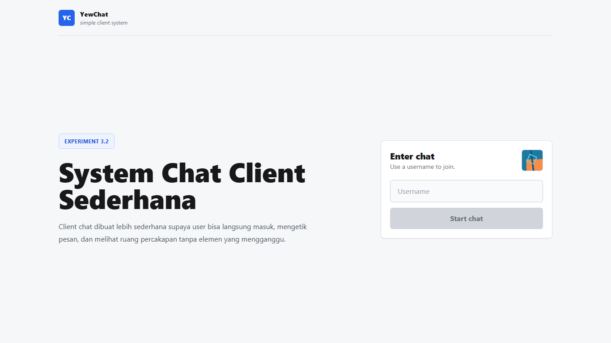

# Tutorial 3: WebChat using Yew

## 3.1 Original code

**Question: What did you do in Experiment 3.1?**

Saya menjalankan kode original dari tutorial WebChat menggunakan Rust, Yew 0.19, WebAssembly, dan WebSocket client. Kode client diadaptasi dari repository YewChat pada branch `websockets-part2`, lalu dependency build diperbarui agar tetap kompatibel dengan Rust dan Node versi saat ini.

**Question: What happens in the original web client?**

Halaman awal menampilkan form login sederhana untuk memasukkan username. Setelah username dikirim, aplikasi akan berpindah ke halaman chat dan mencoba membuat koneksi WebSocket ke `ws://127.0.0.1:8080`.

**Question: Why was a dependency update needed?**

Dependency bawaan tutorial masih memakai versi lama `wasm-bindgen` dan webpack. Pada toolchain sekarang, versi tersebut tidak lagi bisa dibuild, sehingga saya memperbarui dependency minimum yang diperlukan tanpa mengubah alur utama kode original.

## 3.2 Add some creativities to the webclient

**Question: What creative changes did you add to the web client?**

Perubahan utamanya adalah design system baru untuk chat client: warna netral terang, satu warna butto biru, radius yang lebih kecil, panel compact, border konsisten, dan komponen form yang lebih rapi. Saya juga menambahkan empty state pesan dan fallback avatar agar chat tidak langsung panic ketika user pengirim belum ada di daftar user.

**Question: Why are these changes related to creativity?**

Artikel World Economic Forum menekankan bahwa kreativitas tetap penting ketika pekerjaan semakin banyak dibantu AI dan otomasi. Dalam eksperimen ini, kreativitas saya arahkan ke keputusan desain: membuat webclient yang sama terasa berbeda melalui sistem visual yang lebih konsisten, sederhana, dan mudah dipakai.

**Question: What did you learn from this experiment?**

Saya belajar bahwa kreativitas frontend tidak harus selalu berupa fitur besar. Perubahan pada token warna, spacing, bentuk komponen, dan struktur layout bisa mengubah rasa aplikasi secara signifikan tanpa membuat UI menjadi ramai.

**Question: How do you run the project?**

Jalankan `npm install`, lalu jalankan `npm run build` untuk membuat output di folder `dist`. Untuk development, jalankan `npm start`; webclient akan mencoba tersambung ke WebSocket server di `ws://127.0.0.1:8080`.
