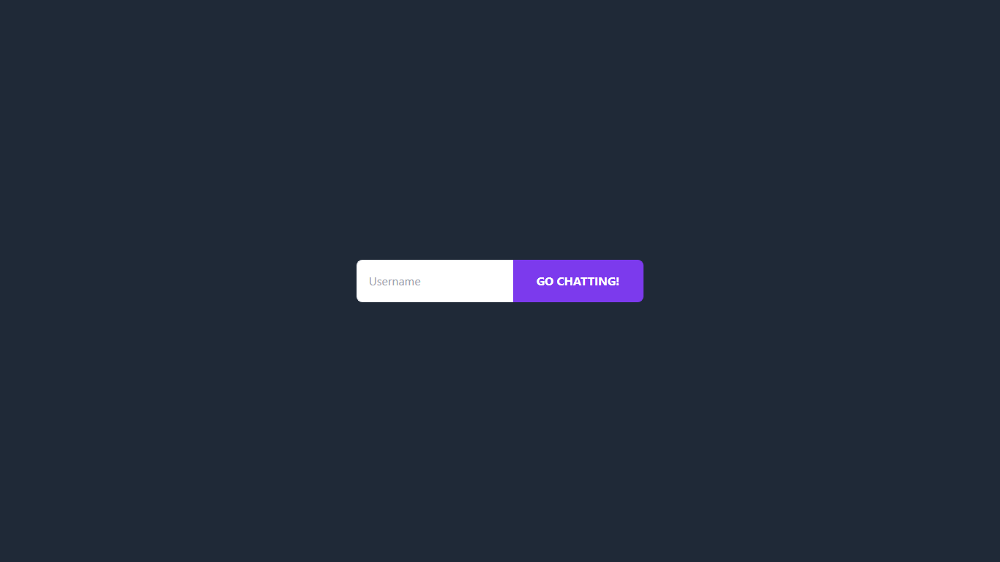

# Tutorial 3: WebChat using Yew

## 3.1 Original code

**Question: What did you do in Experiment 3.1?**

Saya menjalankan kode original dari tutorial WebChat menggunakan Rust, Yew 0.19, WebAssembly, dan WebSocket client. Kode client diadaptasi dari repository YewChat pada branch `websockets-part2`, lalu dependency build diperbarui agar tetap kompatibel dengan Rust dan Node versi saat ini.

**Question: What happens in the original web client?**

Halaman awal menampilkan form login sederhana untuk memasukkan username. Setelah username dikirim, aplikasi akan berpindah ke halaman chat dan mencoba membuat koneksi WebSocket ke `ws://127.0.0.1:8080`.

**Question: Why was a dependency update needed?**

Dependency bawaan tutorial masih memakai versi lama `wasm-bindgen` dan webpack. Pada toolchain sekarang, versi tersebut tidak lagi bisa dibuild, sehingga saya memperbarui dependency minimum yang diperlukan tanpa mengubah alur utama kode original.

